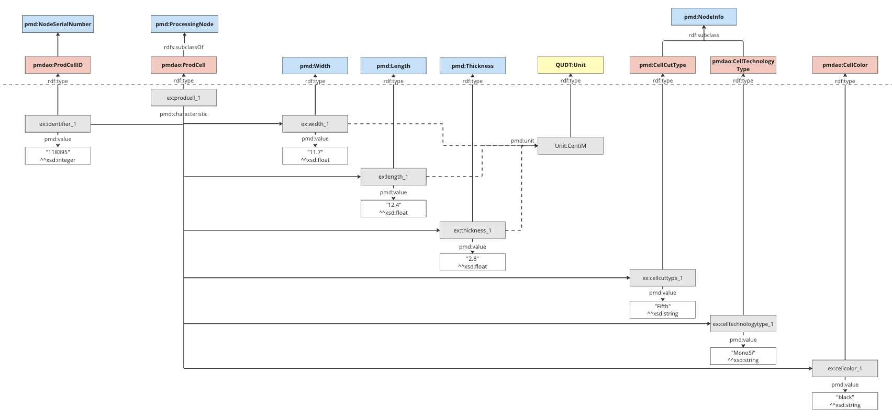

# Summary

The bilingual FAIRmaterials package is a robust and user-friendly tool designed to simplify the creation and visualization of materials and data science ontologies. FAIRmaterials,  available in the Python and R languages, addresses the complexities and technical barriers associated with traditional ontology editors based on manual user input such as 'Protege' [@Protege]. FAIRmaterials offers an intuitive workflow and easy-to-use templates, making it accessible to users both experienced and inexperienced with ontology creation. By leveraging a CSV-based template system, the package allows for the straightforward design and expansion of ontologies, promoting better data accessibility, management, and interoperability in research environments. 

The core feature of the FAIRmaterials package is its ability to programatically convert simple and structured CSV inputs into rich, well-defined ontologies. This capability is designed to support the findability, accessibility, interoperability, and reusability (FAIR) [@wilkinsonFAIRGuidingPrinciples2016] of research data and serve as a tool in the process of data FAIRification. FAIRmaterials also integrates seamlessly with other existing data systems and protocols within the scientific community. The package supports various serialization formats, such as Turtle and JSON-LD, to accommodate different user preferences and technical needs. 

Designed with the end-user in mind, FAIRmaterials facilitates a comprehensive yet entry-level experience in ontology creation. Its additional features, such as automated ontology merging, static visualizations, and comprehensive documentation for outputs extend its utility, making it a valuable tool for any researcher engaged in knowledge management. 


# Statement of need

Protege is currently the most widely-used open-source tool for ontology creation and development. Its main capabilities include manually creating and editing ontological terms and relationships, visualizing ontologies, checking the logical consistency of ontologies, and querying ontologies for specific information. While Protege's extensive functionality even facilitates plugins, the complexity of the interface is a barrier for those who have little experience with ontology creation. This complexity prevents certain researchers from creating and integrating ontologies with their own datasets entirely. Therefore, there is a need for a tool that can create ontologies with an interface that is easily understandable and provides ample documentation on how to use it. FAIRmaterials seeks to lower the barrier of entry for scientists entering the world of ontology development and evolution. The package provides a baseline CSV ontology template with built-in and easy-to-follow instructions on how to design an ontology which can be found [here](https://docs.google.com/spreadsheets/d/1k7gFRc1Yslc-m65aWfFCxqk5UtrKZl9c3GyEFQvLSFU/edit?gid=1078491905#gid=1078491905). 

The CSV format was chosen as an input for FAIRmaterials due to its well-established familiarity within the scientific community as well as its ease of use without the need for specialized tools or programs. 
The primary function of our package is to programmatically convert the filled-out CSV files into a well-structured ontology file. In addition to outputting the ontology in multiple syntaxes, the package outputs other files to aid in the ontology development and publishing process, such as a static visualization and an HTML documentation file about the ontology. 

{ width=100% }


# Key Features

## Ontology creation from template CSVs
The primary function of the FAIRMaterials package is to convert the term, relationship, and value specifications from the CSV template into an ontology. Both the Python and R versions of the package rely on an open-source library called 'RDFLib' [@RDFLibR; @RDFLibPython], which allows users to programmatically create and populate an ontology, serialize it into many syntaxes, validate its logical consistency, and provide output documentation. The package parses through the CSV sheets and generates an RDFLib graph object of the ontology. Both versions of the package also have an add_external_onto_info argument or flag that facilitates the updating of information from the CSV sheets by parsing each external term's ontology. Importing this information  simplifies the process of filling out the sheets, as users do not need to search for this information themselves. An overview of the sheets header is illustrated in Figure 1\autoref{fig:Variable_Sheet_Template_CSV}.

## Ontology serialization into multiple syntaxes
Once an RDFLib graph object is created, the package automatically generates an output folder and serializes the object into two syntaxes: Turtle and JSON-LD. The ontology is serialized into two syntaxes because of the unique advantages that each syntax provides. One of the main advantages of Turtle is that it is easy-to-read by both humans and machines without the need for specialized translators, and it has the syntax requirements to fully represent the complex relationships that Turtle file facilitates. The distinct advantage of JSON-LD is that it is a very common form of linked data in the scientific community, a familiarity that makes it a prime choice for sharing with other researchers and allowing them to make modifications to the ontology, such as adding additional alternative labels to concepts. 

## Static visualization output of ontology
Determining the correctness of an ontology is difficult if its representation is in a textual format. For this reason, the package outputs a visualization in both the R and Python versions. The optional Pyhton flag include_graph_valuetype can be used to include value type nodes in the output visualization. In R, include_graph_valuetype is an argument and can be set to true or false, removing the value type nodes can be helpful to when trying to visualize large ontologies. The Python version uses the Graphviz' [@GraphvizPython] software to create a graph object at the same time as the RDFLib graph object. The package then outputs the Graphviz object as a PNG (as illustrated in Figure 2\autoref{fig:x-sample} so that users can immediately visualize the ontology and make corrections to the sheet if there are inconsistencies.  The color schema and overall design of the Graphviz PNG is modeled after the popular 'WebVOWL' [@Webvowl] ontology visualization tool to make it easier for users to inherently understand the color schema and format. The R version generates a visualization using the 'DiagrammeR' [@DiagrammeR] package available on the Comprehensive R Archive Network (CRAN), as Graphviz is not available in the R language. The output is saved as an SVG for easy visualization with a similar color scheme to the Python package and WebVOWL tool. 

![Figure 2: The X-ray sample ontology. The light-blue icons represent ontology terms, with the prefix (i.e. pmd) indicating the ontology that the term was created in. The dark-blue squared boxes indicate relationships created between entities. The yellow round boxes either indicate the type of the value stored in each subclass or the unit that the value is expressed in, with the prefix indicating the ontology the unit definition belongs to or the schema language that the value type is defined in. \label{fig:x-sample}](mds-XraySampleGraph.png)

## Ontology merging
Both the R and Python versions of the FAIRmaterials package feature an ontology merging capability. The package processes all CSV files within a specified folder and its subdirectories, which will be merged into one ontology. For each subdirectory containing a complete set of CSV sheets, the package generates separate, unmerged outputs. A merged output incorporating all ontologies is created in the main folder path. The merged output can include customized metadata such as title, authors, version, URI, and description. These are included by using the merge_base_uri, merge_title, merge_author, merge_version, and merge_description arguments in R or as a flag in Python. The merge_base_uri must be specified for the merged ontology; other metadata elements may be left to a default. The R version defaults to concatenating the metadata from the included ontologies and the Python version has preset default values. 

## Corresponding documentation output for ontology
One important aspect of ontologies is that they are easily readable by humans as well as machines. Not only do the Turtle and JSON-LD formats have this dual readability, but the HTML documentation also provides a more intuitive interface for humans to understand the terms and relationships stored in ontologies. The Python version of the package leverages this by using RDFLib to output a PyLode HTML file, which consists of user-friendly documentation about the output ontology file. Unfortunately, the R version does not have the same capability because the R version of the RDFlib package does not create HTML files. 


# Typical Usage
In order to use the FAIRmaterials package effectively, a user must conceptualize their ontology, fill out the CSV template, run the package, and finally review the output ontology. 

## Design the ontology schema
It is recommended that users first design an ontology schema that includes all the vocabulary needed to describe a particular dataset. Creating an ontology schema helps to ensure that the ontology has explicit and well-thought-out connections to the Basic Formal Ontology (BFO) or another top level ontology ensuring its interoperability with other, existing ontologies. It is recommended that every variable in the ontology schema is tagged as a subclass of an already-existing ontology term. Other top level terms should be used within the schema when necessary, such as using a QUDT ontology term when associating a certain measurement term with a standardized unit. An example of an ontology schema is showed in Figure 3\autoref{fig:schemaExample}. 



## Complete the CSV template
Users must complete the provided CSV template to input the details of their ontology. The CSV template includes instructions on how to do this, and notifies the user which fields are optional.

## How to run the package
### In Python
To run the FAIRmaterials package in Python, users should execute it from the command line using the following syntax: FAIRmaterials --options. Users must specify the directory containing the CSV sheets using the --folder_path flag and a --merge_base_uri flag if there are two or more sets of ontology files. 
To process the files from a generic path:

```Python
python -m FAIRmaterials --folder_path /path/to/csv/files  --include_graph_valuetype
```

There are several flags such as --include_graph_valuetype, --include_pylode_docs, --add_external_onto_info, and flags for adding merged ontology meta data. 
To process the files with flags ensuring the package generates a pylode adds external information and specifies some ontology metadata:

```Python
python -m FAIRmaterials --folder_path /path/to/csv/files/ 
    --include_graph_valuetype --include_pylode_docs 
    --add_external_onto_info --merge_title MergedPVandXRay 
    --merge_base_uri https://cwrusdle.bitbucket.io/OntologyFilesOwl/Ontology/ 
    --merge_version 1.0
```

The package will then create an ontology graph, saved in PNG format, serialize the RDF object to both Turtle and JSON-LD formats, and create a pylode HTML. 

### In R
To execute the package in R use the process_ontology_files function. 
Users must specify the directory containing the CSV sheets using the folder_path argument and the merge_base_uri argument if there are two or more sets of ontology files. To process the files from a generic path:

```R
FAIRmaterials::process_ontology_files("/path/to/csv/files")
```

There are several arguments such as include_graph_valuetype, add_external_onto_info, and more for adding merged ontology meta data. To process the files with arguments ensuring the package adds external information and specifies some ontology metadata: 

```R
FAIRmaterials::process_ontology_files("/path/to/csv/files", 
    include_graph_valuetype = TRUE, 
    add_external_onto_info = TRUE, 
    merge_title = "MergedPVandXRay", 
    merge_base_uri = "https://cwrusdle.bitbucket.io/OntologyFilesOwl/Ontology/",
    merge_version = "1.0")
```

The package processes these files to create an ontology graph, saved in SVG format, and serializes the RDF object to both Turtle and JSON-LD formats. 

## Finalize and review the output
It is recommended that users carefully examine the generated ontology files and visualizations and make any necessary adjustments to the CSV template based on this review to correct potential errors or to refine the ontology structure. Finally, after review, the user is left with JSON-LD, Turtle, and visualization files that are not only machine-readable, but also human-friendly, and therefore enhance the shareability and usability of the user's research. With this streamlined workflow, researchers at all levels of experience can now utilize ontology development with the FAIRmaterials package. The package allows researchers to focus less on the difficulties of ontology creation and more on their scientific investigations by simplifying the technical aspects of ontology creation.


# Acknowledgements
The development and research of the FAIRmaterials package was made possible through generous support from multiple sources. This work was supported by the U.S. Department of Energy’s Office of Energy Efficiency and Renewable Energy (EERE) under the Solar Energy Technologies Office (SETO) through Agreement Numbers DE-EE0009353 and DE-EE0009347. Additional support was provided by the Department of Energy (National Nuclear Security Administration) under Award Number DE-NA0004104 and Contract Number B647887. 
The authors also gratefully acknowledge funding from the U.S. National Science Foundation under Award Number 2133576.

The authors would like to sincerely thank these organizations for their financial assistance as well as all of the individuals who participated in the project and offered insights and perspectives that were very valuable to the research. 


# Code Availability
The FAIRmaterials Python package can be easily accessed from The Python Package Index (PyPI) [@PyPI]. 
To install the package, simply search for "FAIRmaterials" on the PyPI website or click [here](https://pypi.org/project/FAIRmaterials/) and follow the provided instructions for installation. 

The package can also be installed with the following Python command:
```Python
pip install FAIRmaterials
```

The FAIRmaterials R package can be easily accessed on the Comprehensive R Archive Network (CRAN) [@CRAN]. To install the package, simply search for "FAIRmaterials" on the CRAN website or click [here](https://docs.google.com/spreadsheets/d/1k7gFRc1Yslc-m65aWfFCxqk5UtrKZl9c3GyEFQvLSFU/edit?gid=1078491905#gid=1078491905) and follow the provided instructions for installation. The package can also be installed with the following R command:
```R
install.packages("FAIRmaterials")
library(FAIRmaterials)
```

The package includes comprehensive documentation, including detailed usage examples. 
These can be found in the packages vignette available on the "FAIRmaterials" page on CRAN found [here](https://CRAN.R-project.org/package=FAIRmaterials). You can also access the package vignette after installation using the following R command:
```R
vignette("FAIRmaterials")
```

More documentation can be found after installation using the following R command:
```R
?process_ontology_files
```

The code for both versions can also be accessed through a public GitHub found [here](https://github.com/cwru-sdle/FAIRmaterials) and more documentation for the packages can be found [here](https://cwrusdle.bitbucket.io). 

# Appendix

## Example full set of completed ontology sheets for the mds-XrayToolChess ontology


<br>


<br>


<br>


<br>


# References
