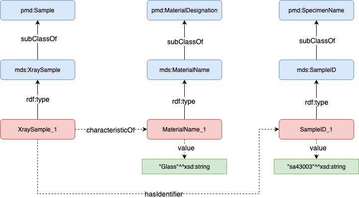
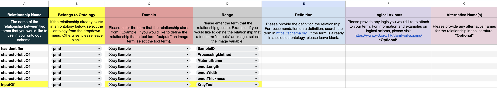

# Summary

The bilingual `FAIRmaterials` package simplifies the creation and visualization of materials and data science ontologies.
`FAIRmaterials`, available in the Python and R languages, addresses the complexities associated with traditional ontology editors based on manual user input such as `Protege` [@Protege] with an intuitive workflow and easy-to-use templates, making it accessible to users both experienced and inexperienced with ontologies.

The `FAIRmaterials` package is its ability to programatically convert simple and structured CSV inputs into rich, well-defined ontologies.
This capability is designed to support the findability, accessibility, interoperability, and reusability (FAIR) [@wilkinsonFAIRGuidingPrinciples2016] of research data and serve as a tool in the process of data FAIRification.

Its additional features, such as automated ontology merging, static visualizations, and comprehensive documentation for outputs extend its utility, making it a valuable tool for any researcher engaged in knowledge management.

# Statement of need

`Protege` is currently the most widely-used open-source tool for ontology creation and development.
Its main capabilities include manually creating and editing ontological terms and relationships, visualizing ontologies, checking the logical consistency of ontologies, and querying ontologies for specific information.
Unfortunately, the complexity of the interface is a barrier for those who have little experience with ontology creation.
This complexity prevents many researchers from creating and integrating ontologies with their own datasets entirely.
Therefore, there is a need for a tool that can create ontologies with an interface that is easily understandable and provides ample documentation on how to use it.
`FAIRmaterials` seeks to lower the barrier of entry for scientists entering the world of ontology development and evolution.
The package provides a baseline CSV ontology template with built-in and easy-to-follow instructions on how to design an ontology which can be found [here](https://github.com/cwru-sdle/FAIRmaterials/tree/main/FAIRSheetTemplates). 
Preliminary applications of the package in additive manufacturing [@FAIRcite1] and PV systems [@Nihar2021] suggest that `FAIRmaterials` offers valuable capabilities for researchers.

{width="100%"}

# Key Features

## Ontology creation from template CSVs

The primary function of the `FAIRMaterials` package is to convert the term, relationship, and value specifications from the CSV template into an ontology. An overview of the sheets descriptive headers is illustrated in \autoref{fig:Variable_Sheet_Template_CSV}.

## Ontology serialization into multiple syntaxes

The package automatically converts the CSV sheets into an RDF object using `RDFlib` [@RDFLibR; @RDFLibPython] and then serializes the object into two syntaxes: Turtle and JSON-LD.
The ontology is serialized into two syntaxes because of the unique advantages that each syntax provides.

## Static visualization output of ontology

Determining the correctness of an ontology is difficult if its representation is in a textual format.
For this reason, the package outputs a visualization in both the R and Python versions.
The optional Python flag `include_graph_valuetype` can be used to include value type nodes in the output visualization.
The visualization is generated using the `Graphviz` [@GraphvizPython] software in the Python version and `DiagrammeR` [@DiagrammeR] in R. Both outputs are modeled after the popular `WebVOWL` [@Webvowl] ontology visualization tool to make it easier for users to inherently understand the color schema and format.

![The X-ray sample ontology. The light-blue icons represent ontology terms, with the prefix (i.e. pmd) indicating the ontology that the term was created in. The dark-blue squared boxes indicate relationships created between entities. The yellow round boxes either indicate the type of the value stored in each subclass or the unit that the value is expressed in, with the prefix indicating the ontology the unit definition belongs to or the schema language that the value type is defined in. \label{fig:x-sample}](mds-XraySampleGraph300.png){height=200%}

## Ontology merging

Both the R and Python versions of the `FAIRmaterials` package feature an ontology merging capability.
The package processes all CSV files within a specified folder and its subdirectories, merging them into one ontology created in the main folder path. For each subdirectory containing a complete set of CSV sheets, the package generates separate, unmerged outputs. The merged output can also include customized metadata such as title, authors, version, URI, and description.

## Corresponding documentation output for ontology

One important aspect of ontologies is that they are easily readable by humans as well as machines.
The HTML documentation provides an intuitive interface for humans to understand the terms and relationships stored in ontologies. The Python version of the package leverages this by using `RDFLib` to output a PyLode HTML file. Unfortunately, the R version does not have the same capability because the R version of the RDFlib package does not create HTML files.

# Typical Usage

It is recommended that users first design an ontology schema that includes all the vocabulary needed to describe a dataset. This ensures explicit connections to the Basic Formal Ontology (BFO) or another top-level ontology, ensuring its interoperability with other existing ontologies. Every variable in the ontology schema should be tagged as a subclass of an already-existing ontology term or it should be a new term. Other top-level terms should be used within the schema when necessary, such as using a QUDT ontology term when associating a certain measurement term with a standardized unit.
An example of an ontology schema is showed in \autoref{fig:schemaExample}.

{width=150%, height=150%}

Post-execution, users should review the output to ensure accuracy and make necessary adjustments. This streamlined workflow facilitates effective ontology development without requiring extensive technical expertise.

# Code Availability

To install Python version of `FAIRmaterials`, simply search for it on the The Python Package Index (PyPI) [@PyPI] website or click [here](https://pypi.org/project/FAIRmaterials/).
The `FAIRmaterials` R version can be easily accessed on the Comprehensive R Archive Network (CRAN) [@CRAN].
To install the package, simply search for `FAIRmaterials` on the CRAN website or click [here](https://cran.r-project.org/web/packages/FAIRmaterials/index.html). The code for both versions can also be accessed through a public GitHub found [here](https://github.com/cwru-sdle/FAIRmaterials) and more documentation for the packages can be found [here](https://cwrusdle.bitbucket.io).

# Acknowledgements

The development and research of the `FAIRmaterials` package was made possible through generous support from multiple sources.
This work was supported by the U.S.
Department of Energy's Office of Energy Efficiency and Renewable Energy (EERE) under the Solar Energy Technologies Office (SETO) through Agreement Numbers DE-EE0009353 and DE-EE0009347.
Additional support was provided by the Department of Energy (National Nuclear Security Administration) under Award Number DE-NA0004104 and Contract Number B647887 and from the U.S. National Science Foundation under Award Number 2133576.

The authors would like to sincerely thank these organizations for their financial assistance as well as all of the individuals who participated in the project.

# Appendix

Example full set of completed ontology sheets for the mds-XrayToolChess ontology

\newpage

# References

